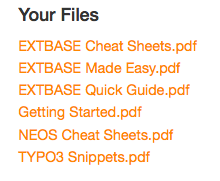
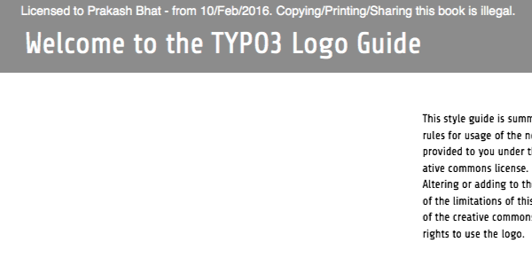

.. ==================================================
.. FOR YOUR INFORMATION
.. --------------------------------------------------
.. -*- coding: utf-8 -*- with BOM.

.. include:: ../Includes.txt

What does it do?
================

This extension helps you in serving two different purposes:
a) Adding some text to the downloaded PDF file.
b) Securely download a PDF file, without letting anyone know about hte storage path.

.. _team: http://www.scwebs.in

	Frontend Output of various files from a selected folder.

	We can customize various parameters of the message

The the Plugin configuration allows us to customize parameters such as:
- The position
- Font family
- Font size
- Font color

We can even add the name of the FE User, and other dynamic properties like the date/time to the PDF file.