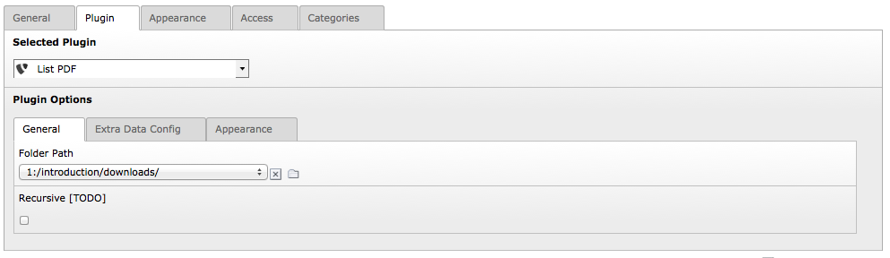
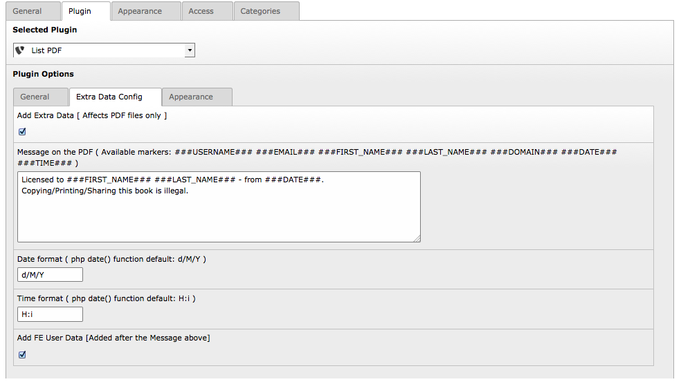
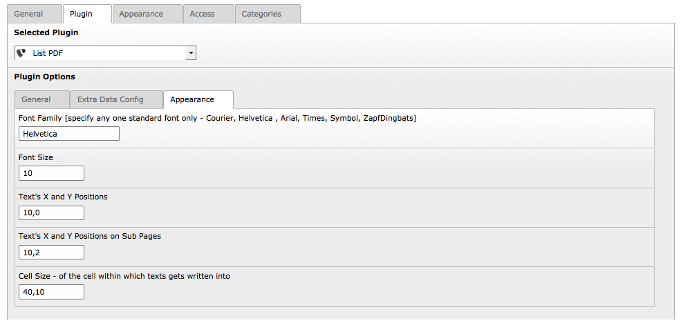

.. ==================================================
.. FOR YOUR INFORMATION
.. --------------------------------------------------
.. -*- coding: utf-8 -*- with BOM.

.. include:: ../Includes.txt

.. _users-manual:

Users manual
============

To start with add the plugin titled "List PDF (pdflister)" on any page of your choice.
Once added you may make some customizations, using the remaining two tabs, or you can also see the frontend results, and download a file.
The files thus downloaded will have some messages added at the top left corner.

TAB: General
------------------------------

    	The General Tab

In the General Tab, select the folder path. You must ensure to keep all of your PDF files in this location.

Recursive Option [TODO] - the idea here is to check all the sub-folders (recursively) and list all the PDF files in an appropriate manner.

    This feature is yet to be done, and I am looking for any sponsors to write code for this. Thank you in advance.

TAB: Extra Data Config
------------------------------

        Extra Data Config Tab

In the Extra Data Config Tab, you can customize the exact data that needs to be added to the PDF files when downloaded.

You have the option to add date, time and the domain name. You also have the option to add the FEUSER data to the PDF files.

When a Front-End USER (FE USER) is logged in and if the checkbox "Add FE User Data" is checked, you can also add his username, first name and last name to the PDF files.

The text field "Message on the PDF" exactly lets you customize the message data that needs to be added on the PDF files.

As of current date the list of available markers are as follows:

###USERNAME###

###EMAIL###

###FIRST_NAME###

###LAST_NAME###

###DOMAIN###

###DATE###

###TIME###

NOTE: Ensure that the checkbox "Add Extra Data" is checked, else the PDF files will not have any custom message added.

Date, and Time format fields allows you to specify the formats needed for the Date/Time fields.

TAB: Appearance
------------------------------

        The Appearance Tab

Using the Appearance Tab, you can customize parameters of message such as the Font, Font size, position on first page, and the sub pages and the cell size.

For the Font Family - the supported font names are "Courier, Helvetica , Arial, Times, Symbol, ZapfDingbats" ONLY.

The message can be positioned in a different place on home page, while the same can be in a different place on all other pages.
There is no support yet to have a different position on last the page of the PDF, hopefully this would be added soon in the coming release.